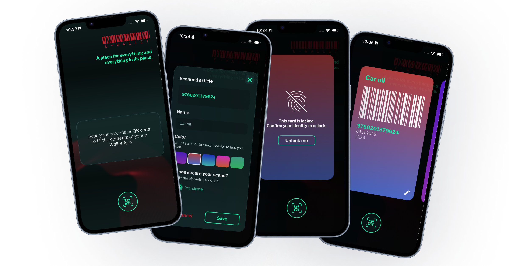

# 📱 Mobility Suite mos. Showcase – Gas Station App

<table>
<tr>
<td width="60%" valign="top">

**e-Wallet App** is a public showcase project built using the **mos.** technology.  
It demonstrates the technology's ability to build real-world, data-driven mobile applications.

The app allows users to:
- Scan EAN-13 barcodes with the camera
- Store scanned barcodes as cards
- Customize cards: assign different names and colors
- Protect your cards with device biometrics (Face ID / Touch ID)

> [!IMPORTANT]
> This project is a public showcase only. It is **not intended for production use** or app store distribution.

</td>
<td width="40%" valign="middle">

### 📚 Table of Contents

| Section | Description |
|--------|-------------|
| [Mobility Suite mos.](#-powered-by-mobility-suite-mos) | Core platform powering the app |
| [App Overview](#-app-overview) | High-level summary |
| [User Flow & Features](#-user-flow--features) | Key interactions and logic |

</td>
</tr>
</table>

## 🚀 Powered by Mobility Suite mos.

  

  <a href="https://mobilitysuite.de/">Home Page</a> |
  <a href="https://documentation.mobilitysuite.de/">Documentation</a> |
  <a href="https://academy.mobilitysuite.de/">Academy</a>

<strong>Mobility Suite mos.</strong> is a low-code framework for the development of native and cross-platform apps. 
Solution that provides tools to accelerate development and reduce it's complexity, enabling faster deployment  and easier maintenance with minimal coding expertise required.

## 📖 App Overview

This showcase app demonstrates a variety of **mos.** features in a simple scenario. It simulates how a developer could create a utility app that utilises device functions to get and store local data – all using the low-code approach of mos.

  

## 🧩 User Flow & Features

1. **Add a Card**
    - Users scans an EAN-13 barcode.
    - User sets: 
      - Name of the card
      - Color of the card
      - Encryption flag

2. **Edit a Card** 
    - User can edit:
      - Name of the card
      - Color of the card
      - Encryption flag

3. **User a Card**
    - User can unlock a card and show the barcode on screen.

4. **Security**
    - Cards can be locked with device biometrics.
    - All cards will be locked after app was closed.

6. **Storage**
    - User's cards are stored locally on the device.
    - No account, no sync, no tracking.